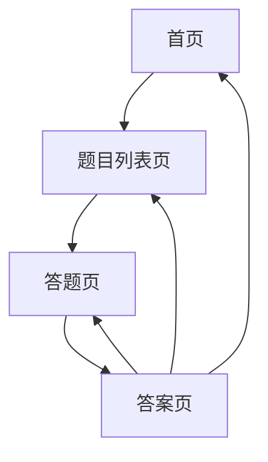

## 1. 产品概述

一个基于Excel题库的在线刷题网站，帮助用户高效练习题目。支持题目列表浏览、答题模式和答案查看功能。

目标用户：需要刷题练习的学生和考生，提供便捷的在线练习体验。

## 2. 核心功能

### 2.1 用户角色
无需用户注册，所有用户均可直接访问使用刷题功能。

### 2.2 功能模块

刷题网站包含以下核心页面：

1. **首页**：题目分类导航、练习统计、快速开始
2. **题目列表页**：题目展示、筛选搜索、开始练习
3. **答题页**：题目展示、选项选择、答题进度
4. **答案页**：答案解析、正确答案显示、返回练习

### 2.3 页面详情

| 页面名称 | 模块名称 | 功能描述 |
|---------|---------|---------|
| 首页 | 导航栏 | 显示网站Logo和主要功能入口 |
| 首页 | 分类卡片 | 展示不同题目分类，点击进入对应题目列表 |
| 首页 | 统计信息 | 显示总题数、已练习题数等基础统计 |
| 题目列表页 | 搜索筛选 | 支持按关键词搜索和分类筛选题目 |
| 题目列表页 | 题目卡片 | 显示题目编号、标题、难度等基础信息 |
| 题目列表页 | 批量操作 | 支持选择多题开始练习 |
| 答题页 | 题目展示 | 清晰显示题目内容和选项 |
| 答题页 | 答题交互 | 点击选项进行选择，显示选择状态 |
| 答题页 | 进度控制 | 显示当前进度，支持上一题/下一题切换 |
| 答题页 | 提交答案 | 完成答题后提交查看结果 |
| 答案页 | 结果展示 | 显示答题正确率和每题对错状态 |
| 答案页 | 答案解析 | 显示正确答案和详细解析 |
| 答案页 | 重新练习 | 支持重新开始练习或返回列表 |

## 3. 核心流程

用户操作流程：
1. 用户进入首页，浏览题目分类
2. 选择分类进入题目列表页
3. 浏览题目，选择开始练习
4. 进入答题页，逐题作答
5. 完成答题后查看答案解析
6. 可选择重新练习或返回列表

## 4. 用户界面设计

### 4.1 设计风格
- 主色调：蓝色系（#1890ff）体现专业和信任感
- 辅助色：绿色（#52c41a）表示正确，红色（#f5222d）表示错误
- 按钮样式：圆角矩形，悬停效果明显
- 字体：系统默认字体，标题16-18px，正文14px
- 布局：卡片式布局，间距统一为16px或24px
- 图标：使用简洁的线性图标，保持风格统一

### 4.2 页面设计概览

| 页面名称 | 模块名称 | UI元素 |
|---------|---------|--------|
| 首页 | 导航栏 | 白色背景，蓝色Logo，简洁导航文字 |
| 首页 | 分类卡片 | 白色卡片，蓝色边框，图标+文字布局 |
| 首页 | 统计信息 | 浅色背景，大号数字显示关键指标 |
| 题目列表页 | 搜索栏 | 圆角输入框，蓝色搜索按钮 |
| 题目列表页 | 题目卡片 | 白色卡片，显示题号/标题/难度标签 |
| 答题页 | 题目区域 | 大字体显示题目，选项使用单选框 |
| 答题页 | 控制栏 | 底部固定，包含进度条和操作按钮 |
| 答案页 | 结果卡片 | 绿色/红色标识正确/错误题目 |
| 答案页 | 解析区域 | 展开式卡片，显示详细解析内容 |

### 4.3 响应式设计
采用桌面端优先设计，适配平板和手机端：
- 桌面端：最大宽度1200px，充分利用屏幕空间
- 平板端：适配768px-1024px，调整卡片布局
- 手机端：单列布局，触摸友好的按钮尺寸（最小44px）

## 5. 数据源说明

题目数据来源于已有的Excel文件（practice.xlsx），包含题目内容、选项、正确答案等信息。系统需要解析Excel文件并提供API接口供前端调用。