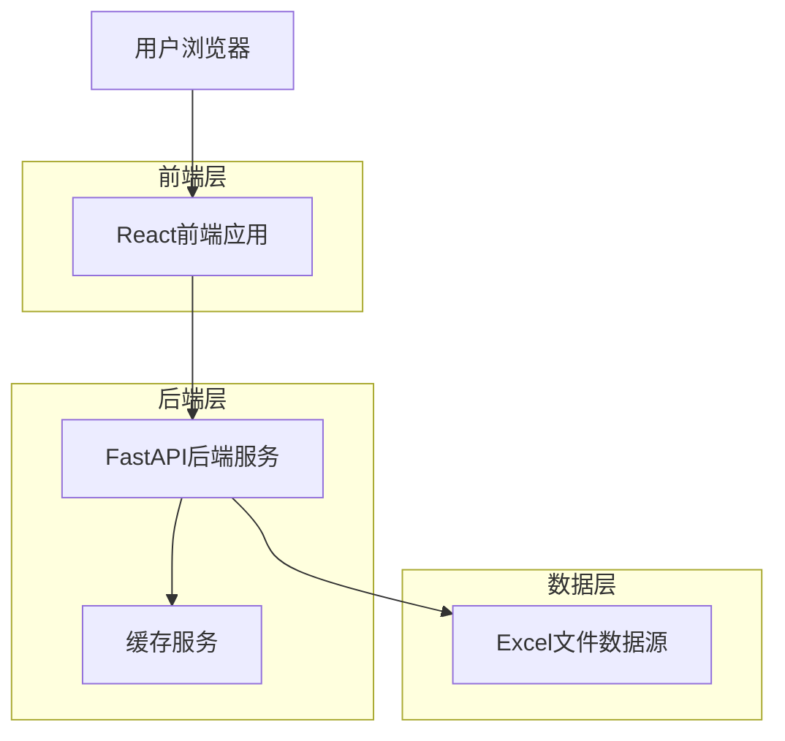
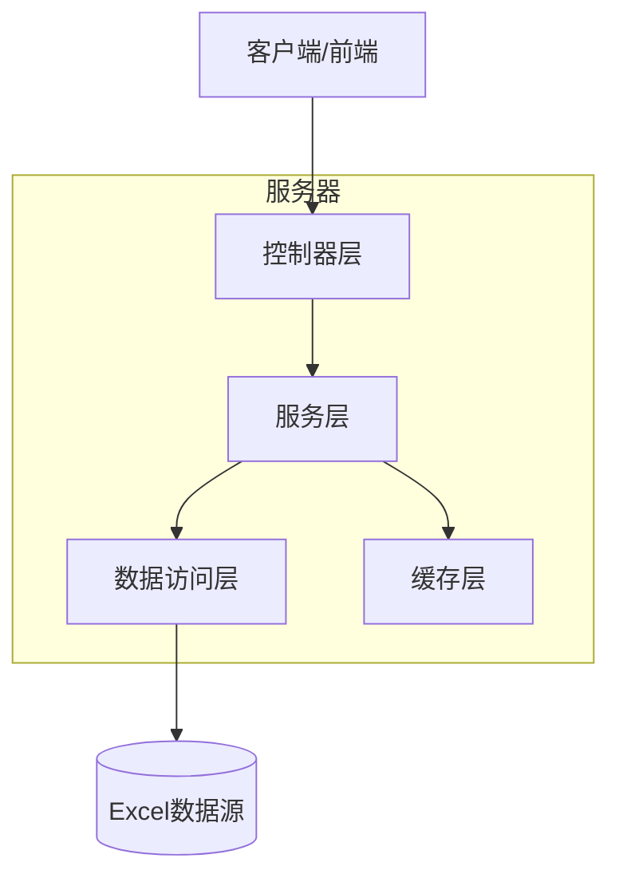
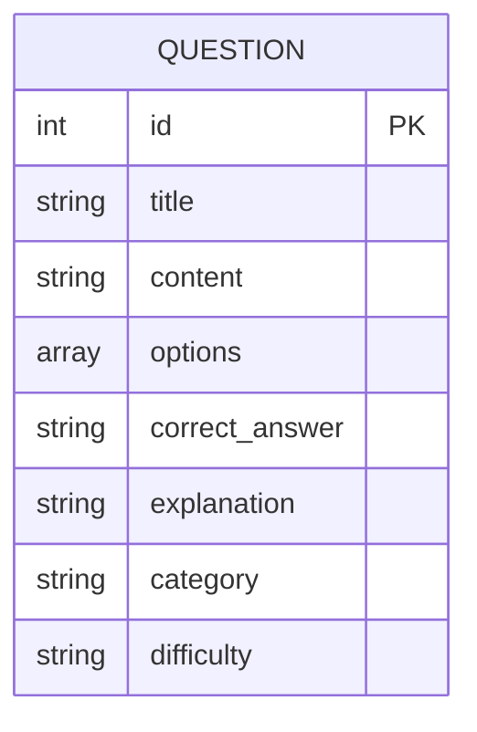

## 1. 架构设计



## 2. 技术描述

- 前端：React@18 + TypeScript + TailwindCSS@3 + Vite
- 初始化工具：vite-init
- 后端：FastAPI（Python）
- 数据源：Excel文件（practice.xlsx）
- 缓存：Redis（可选，用于题目缓存）

## 3. 路由定义

| 路由 | 用途 |
|------|------|
| / | 首页，显示题目分类和统计信息 |
| /questions | 题目列表页，展示所有题目 |
| /quiz | 答题页，进行题目练习 |
| /result | 答案页，显示答题结果和解析 |

## 4. API定义

### 4.1 题目相关API

获取题目列表
```
GET /api/questions
```

请求参数：
| 参数名 | 参数类型 | 是否必需 | 描述 |
|--------|----------|----------|------|
| category | string | false | 题目分类筛选 |
| difficulty | string | false | 难度筛选 |
| page | integer | false | 页码，默认为1 |
| limit | integer | false | 每页数量，默认为20 |

响应：
```json
{
  "code": 200,
  "data": {
    "questions": [
      {
        "id": 1,
        "title": "题目标题",
        "content": "题目内容",
        "options": ["A. 选项1", "B. 选项2", "C. 选项3", "D. 选项4"],
        "correct_answer": "A",
        "explanation": "答案解析",
        "category": "分类名称",
        "difficulty": "easy"
      }
    ],
    "total": 100,
    "page": 1,
    "limit": 20
  }
}
```

获取单个题目详情
```
GET /api/questions/{id}
```

提交答题结果
```
POST /api/quiz/submit
```

请求体：
```json
{
  "answers": [
    {
      "question_id": 1,
      "user_answer": "A"
    }
  ]
}
```

响应：
```json
{
  "code": 200,
  "data": {
    "score": 85,
    "correct_count": 17,
    "total_count": 20,
    "results": [
      {
        "question_id": 1,
        "user_answer": "A",
        "correct_answer": "A",
        "is_correct": true,
        "explanation": "答案解析"
      }
    ]
  }
}
```

## 5. 服务器架构图



## 6. 数据模型

### 6.1 数据模型定义

由于使用Excel文件作为数据源，主要数据结构如下：



### 6.2 Excel数据结构

Excel文件应包含以下列：
- id: 题目ID（唯一标识）
- title: 题目标题
- content: 题目内容
- option_a: 选项A
- option_b: 选项B
- option_c: 选项C
- option_d: 选项D
- correct_answer: 正确答案（A/B/C/D）
- explanation: 答案解析
- category: 题目分类
- difficulty: 难度等级（easy/medium/hard）

### 6.3 缓存策略

为提高性能，采用以下缓存策略：
- 题目列表缓存：TTL 1小时
- 单个题目缓存：TTL 30分钟
- 答题结果不缓存，确保实时性

## 7. 部署建议

- 前端：静态文件部署到CDN
- 后端：Docker容器化部署
- Excel文件：存储在服务器本地或云存储
- 缓存：Redis云服务或本地部署